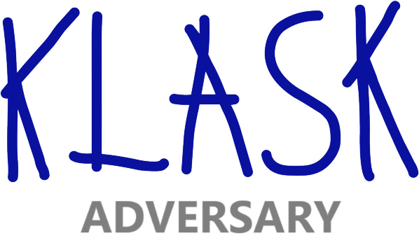

# Klask Reborn
## Klask Adversary AI Project

## Goal
The Klask Adversary AI project aims to develop a deep reinforcement learning agent skilled enough to beat human opponents in the game of [Klask](https://www.klaskgame.com/).

## Repository Contents

This repository contains:

- [**Klask Simulator**](src/KlaskLib/simulator/README.md) models the physics of playing Klask as well as enforces game rules.

- [**Klask Environment**](src/KlaskLib/environment/README.md) using the simulator, an agent can learn and play the game of Klask against itself, other agents, and human opponents.

- **Klask Agent** coming soon.

## Installation
`./setup.sh`

## Environment Activation
`source .venv/bin/activate`

## Demo Application
This application demonstrates basic interaction with the Klask Environment.

`python3 src/demo.py`
